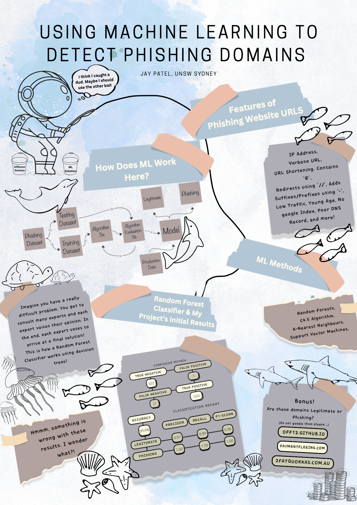

This project aimed to develop a machine-learning algorithm capable of classifying phishing domains effectively. Combining research, implementation, and evaluation, it highlights key findings, challenges, and areas for future exploration. 

Below is a synthesised overview of the project.

---

## **Introduction**

Phishing remains a critical cybersecurity challenge, with billions of malicious emails sent daily. These attacks often leverage fraudulent URLs designed to mimic legitimate sites, tricking users into revealing sensitive information. Developing an automated system to detect such phishing attempts is crucial to improving cybersecurity defenses.

### **Characteristics of Phishing Domains**

Phishing URLs share common characteristics that can aid detection:

- **IP Address Usage**: Instead of proper domain names.
- **Verbose URLs**: Lengthy URLs designed to obscure their true nature.
- **Suspicious Symbols**: Use of `@`, `//`, or hyphenated prefixes and suffixes.
- **Subdomain Exploitation**: Multiple subdomains to mimic legitimate URLs.
- **Poor Security**: HTTP instead of HTTPS.

While heuristic methods and blacklists are widely used, they lack adaptability to evolving phishing techniques. Machine learning (ML) offers a dynamic and scalable alternative.

---

## **Research and Literature Review**

This project explored various machine learning methods for phishing detection. Key techniques included:

- **k-Nearest Neighbors (k-NN)**: Effective for pattern matching but limited scalability.
- **Support Vector Machines (SVM)**: High precision but computationally intensive.
- **Random Forest Classifiers**: Combining multiple decision trees to improve prediction accuracy.

Hybrid models, integrating multiple classifiers and feature selection techniques like ANOVA, have achieved accuracy rates exceeding 99%. Random Forest Classifiers were chosen for this project due to their robustness and versatility.

---

## **Methodology**

### **Data Collection**

High-quality datasets were crucial for building an accurate model. Sources included:

- **Phishing URLs**: Gathered from public repositories like [Phishing.Database](https://github.com/mitchellkrogza/Phishing.Database).
- **Legitimate URLs**: Sourced from Australian business domain registries.

The dataset was imbalanced, with phishing URLs significantly outnumbering legitimate ones, which introduced challenges for model training.

### **Preprocessing**

Data preprocessing involved:

- **Normalisation**: Stripping domain suffixes (e.g., `.au`) to minimise biases.
- **Feature Extraction**: Analysing URL length, symbol usage, and subdomain patterns.

### **Model Development**

- A supervised Random Forest Classifier was implemented using Python’s `scikit-learn` library.
- Data was split into training and testing sets to ensure robust evaluation.
- Hyperparameter tuning was performed to optimise the model’s performance.

---

## **Results**

The Random Forest Classifier delivered strong results:

| Class           | Precision | Recall | F1-Score | Support |
|-----------------|-----------|--------|----------|---------|
| **Legitimate**  | 0.97      | 0.99   | 0.98     | 629     |
| **Phishing**    | 1.00      | 1.00   | 1.00     | 5566    |

While the overall accuracy exceeded 99%, challenges included:

- **Dataset Imbalance**: Overrepresentation of phishing domains led to predictive biases.
- **Suffix Bias**: Legitimate domains with `.au` were occasionally misclassified.

---

## **Challenges and Reflections**

This project underscored the importance of thoughtful dataset preparation and feature engineering. Challenges included:

- **Limited AI Experience**: Building a machine-learning model from scratch required significant research and iterative learning.
- **Data Collection**: Balancing phishing and legitimate URLs proved challenging but essential for unbiased results.
- **Presentation**: Conveying the project clearly and effectively involved creating a poster for the SecEdu conference.

Despite these challenges, the project provided valuable insights into the practical application of ML in cybersecurity.

---

## **Future Directions**

Enhancements to this project could include:

- **Balancing Techniques**: Employing methods like SMOTE (Synthetic Minority Oversampling Technique) to address dataset imbalance.
- **Feature Expansion**: Incorporating semantic analysis of URL content.
- **Hybrid Models**: Combining Random Forests with other classifiers for improved robustness.
- **Real-Time Deployment**: Developing browser plugins or APIs for live phishing detection.

---

## **Conclusion**

This project demonstrated the potential of machine learning to tackle phishing threats, highlighting both its strengths and areas for improvement. By refining dataset preparation and exploring advanced ML techniques, this solution can evolve into a more comprehensive cybersecurity tool.

---

## **Poster Preview**  
  